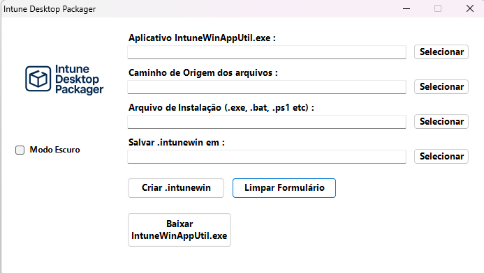
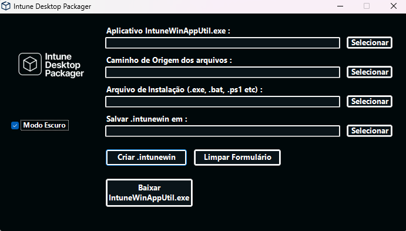
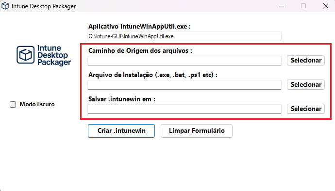
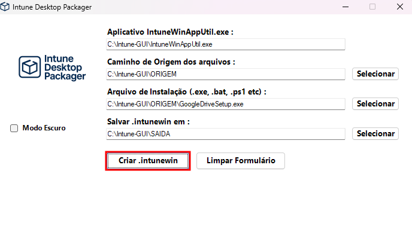
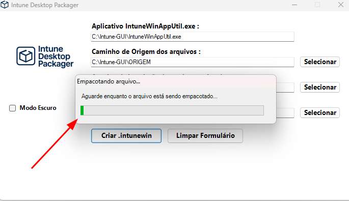

# Intune Desktop Packager

É uma ferramenta com interface gráfica desenvolvida em PowerShell que simplifica a criação de pacotes `.intunewin` para distribuição de aplicativos via Microsoft Intune (Endpoint Manager).

## 📦 Visão Geral

Este utilitário simplifica o processo de conversão de instaladores tradicionais (como `.exe` ou `.msi`) para o formato `.intunewin`, permitindo a distribuição automatizada de aplicativos via Microsoft Endpoint Manager (Intune).

## ⚙️ Funcionalidades

- Interface gráfica amigável e moderna
<table>
  <tr>
    <td></td>
  </tr>
</table>

- Modo escuro nativo
<table>
  <tr>
    <td></td>
  </tr>
</table>

- Detecção automática do utilitário `IntuneWinAppUtil.exe`
  - Caso não esteja presente na pasta do script, o aplicativo é baixado automaticamente.
- Preenchimento automático do caminho do executável após o download
<table>
  <tr>
    <td></td>
  </tr>
</table>

- Download automático dos logotipos personalizados, se ausentes
- Exibição de mensagens informativas durante o processo
- Geração de log detalhado com cada conversão de pacote `.intunewin`
- Botão para limpar os campos e reiniciar o processo

## 📁 Estrutura

- `IntuneWinAppUtil.exe` – binário oficial da Microsoft necessário para empacotar
- `Intune-Packager.log` – log com histórico das conversões
- `Intune-Desktop-Packager.ps1` – script principal com interface gráfica
- `Intune-Desktop-Packager.ico` - ícone personalizado para o atalho da ferramenta no desktop

## 💻 Requisitos

- Windows PowerShell 5.1 ou superior
- Sistema operacional Windows 10/11
- Acesso a Internet para download do executável `IntuneWinAppUtil.exe` fornecido pela Microsoft

## 🚀 Como usar

1. Execute o script `Intune-Desktop-Packager.ps1`
```powershell
powershell.exe -ExecutionPolicy Bypass -WindowStyle Minimized -File .\Intune-Desktop-Packager.ps1
```

2. Preencha os campos com as informações necessárias:
<table>
  <tr>
    <td></td>
  </tr>
</table>

3. Clique em **Criar .intunewin** para gerar o arquivo `.intunewin`
<table>
  <tr>
    <td></td>
  </tr>
</table>

> *Nota:* será exibida uma mensagem para aguardar o término do processo conforme imagem a seguir:
<table>
  <tr>
    <td></td>
  </tr>
</table>

4. Ao término do processo, será exibida uma mensagem de Sucesso ou Falha:
<table>
  <tr>
    <td></td>
  </tr>
</table>

5. Um arquivo de log chamado `Intune-Packager.log` será gerado automaticamente, registrando todas as ações de criação de pacotes `.intunewin` realizadas pela ferramenta:
<table>
  <tr>
    <td></td>
  </tr>
</table>

---

⬅️ [Voltar à Página Principal](https://github.com/jardelsantos78/intune-deploy-apps/tree/main)
