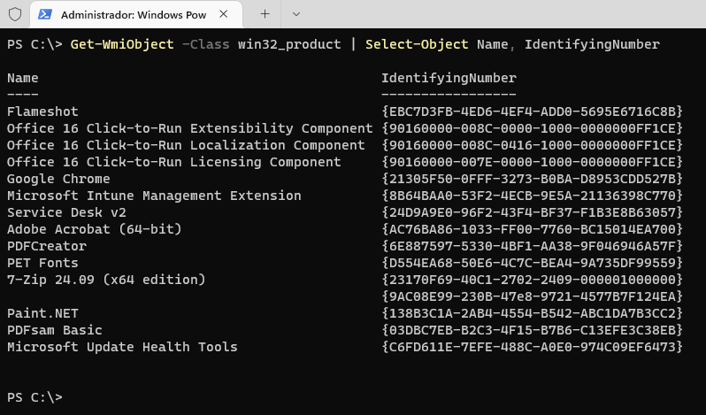
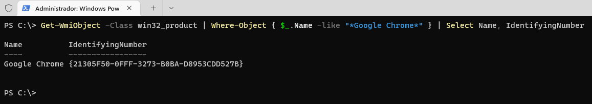

## 🧭 O que é o `{GUID}`?

O `{GUID}` — abreviação de *Globally Unique Identifier* — é um identificador global único usado para distinguir de forma exclusiva cada instalação de aplicativo no Windows, especialmente os instalados via arquivos MSI.

Esse identificador é essencial para operações de automação como desinstalações silenciosas e gerenciamento remoto via Microsoft Intune. Ele permite que o sistema identifique com precisão qual versão do software deve ser manipulada, evitando conflitos com outros aplicativos semelhantes.

No contexto do Intune, o `{GUID}` é frequentemente utilizado na linha de desinstalação, no seguinte formato:

```cmd
msiexec /x "{GUID}" /quiet
```

### 🔍 Descobrindo o GUID de um Aplicativo MSI via PowerShell

Este guia mostra como identificar o `{GUID}` de um aplicativo instalado no Windows, informação essencial para configurar corretamente a desinstalação silenciosa no Intune.

### ✅ Pré-requisitos

- O aplicativo deve estar instalado na máquina de teste.
- A execução de scripts PowerShell deve ser permitida.

### 💻 Etapas

1. **Abra o PowerShell como administrador.**

2. **Execute o seguinte comando para listar todos os aplicativos MSI com seus respectivos GUIDs:**

```powershell
Get-WmiObject -Class Win32_Product | Select-Object Name, IdentifyingNumber
```

<p>
  
</p>

3. **Localize o nome do aplicativo desejado** na lista exibida. O valor da coluna `IdentifyingNumber` será o GUID.

#### 🎯 Dica: Filtrando por nome

Se quiser encontrar rapidamente o GUID de um aplicativo específico, você pode filtrar a pesquisa pelo nome com o seguinte comando:

```powershell
Get-WmiObject -Class Win32_Product | Where-Object { $_.Name -like "*NomeDoApp*" } | Select Name, IdentifyingNumber
```
- Substitua `"NomeDoApp"` por parte do nome do aplicativo que deseja localizar.

<p>
  
</p>

#### ⚠️ Observações

- Esse comando pode causar uma revalidação silenciosa dos instaladores MSI na máquina. Para inspeção sem impactos, considere usar ferramentas como o [Regedit](https://learn.microsoft.com/en-us/windows/win32/sbscs/registry-entries-for-installed-applications) ou o utilitário **Orca**.

#### 🗂️ Alternativa: Consultando diretamente o Registro do Windows

Outra forma (*e talvez a mais recomendada*) de localizar o GUID é acessando as chaves de registro onde o Windows armazena informações dos aplicativos instalados:

```powershell
Get-ChildItem -Path HKLM:\SOFTWARE\Microsoft\Windows\CurrentVersion\Uninstall, `
HKLM:\SOFTWARE\Wow6432Node\Microsoft\Windows\CurrentVersion\Uninstall | `
Get-ItemProperty | `
Where-Object { $_.DisplayName -like "*NomeDoApp*" }
```

> 🔍 Essa abordagem é especialmente útil para identificar aplicativos que não aparecem no `Win32_Product`, além de evitar a reconfiguração silenciosa dos instaladores MSI — algo que pode ocorrer ao usar o `Get-WmiObject`.

- O `{GUID}` deve ser usado na linha de desinstalação como:

```cmd
msiexec /x "{GUID}" /quiet
```
