# 📁 Deploy de Aplicativos com arquivo .intunewin

Para aplicativos personalizados ou instaladores não MSI, é possível encapsular arquivos `.exe`, `.bat` etc em formato `.intunewin`.

## ✅ Pré-requisitos

- Ferramenta [Microsoft Win32 Content Prep Tool](https://github.com/Microsoft/Microsoft-Win32-Content-Prep-Tool).
   > **Nota:** há diversas ferramentas na internet que servem como frontend GUI para o aplicativo da Microsoft sendo assim, para facilitar o processo de criação será disponibilizado neste repositório o código script Powershell de um frontend que estou desenvolvendo para uso interno. Para saber mais, consulte [Intune Desktop Packager](./GUI/intune-gui.md)
- Arquivos de instalação prontos (como instaladores .exe, .msi, .bat, .cmd, .ps1 etc.).
- Parâmetros de instalação silenciosa.
   > **Dica**: consulte os sites [SilentInstalHQ](https://silentinstallhq.com/) ou [Manage Engine Endpoint Central](https://www.manageengine.com/products/desktop-central/software-installation/latest-software.html) para descobrir os parâmetros de instalação silenciosa.

## 📦 Criando o pacote .intunewin

### Utilizando linha de comando
Para criação de pacote a partir de linha de comando, baixe a ferramenta no link informado anteriormente, abra o PowerShell como administrador e execute o seguinte comando:
```bash
IntuneWinAppUtil -c <pasta_do_instalador> -s <arquivo_setup> -o <pasta_de_saida>
```
<table>
  <tr>
    <td>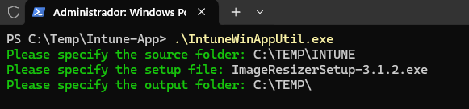</td>
  </tr>
</table>

### 🖥️ Utilizando a Interface Gráfica (GUI)

- Faça o download da ferramenta em [Intune Desktop Packager](./GUI/intune-gui.md).
- Ao executar o arquivo **Intune-Desktop-Pack.exe** pela primeira vez, os componentes necessários serão baixados automaticamente e salvos na mesma pasta.
- Com uma interface gráfica intuitiva, o processo de empacotamento torna-se mais rápido, acessível e livre de linhas de comando.
<table>
  <tr>
    <td>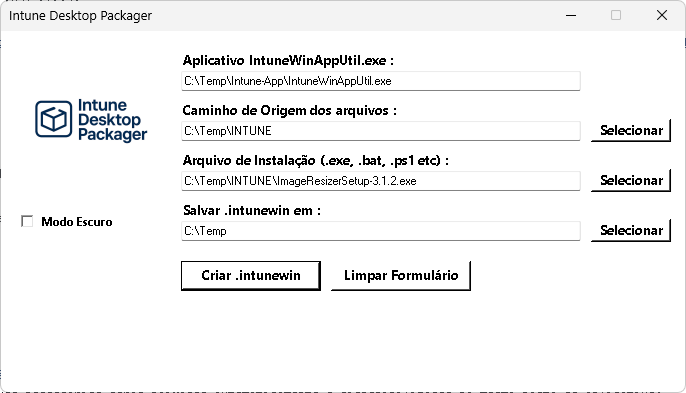</td>
  </tr>
</table>
<table>
  <tr>
    <td>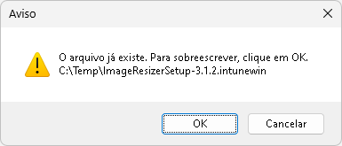</td>
  </tr>
</table>
<table>
  <tr>
    <td></td>
  </tr>
</table>

## 🚀 Etapas no Intune

1. Acesse o [Centro de Administração do Microsoft Intune](https://intune.microsoft.com);
2. Navegue até **Aplicativos > Todos os aplicativos > Criar**;
<table>
  <tr>
    <td>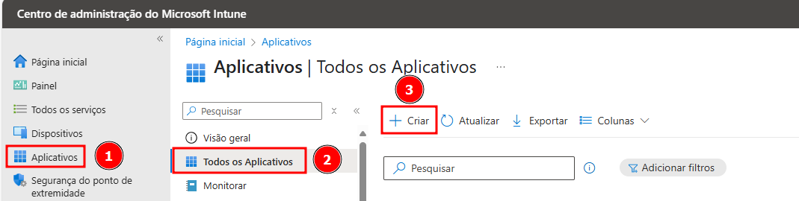</td>
  </tr>
</table>

3. Escolha o tipo de aplicativo: **Aplicativo do Windows (Win32)**;
<table>
  <tr>
    <td>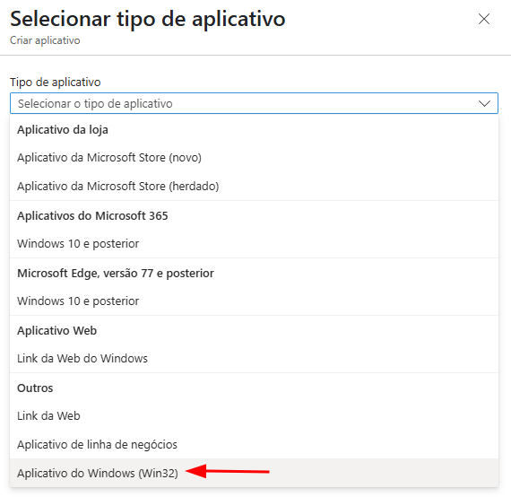</td>
  </tr>
</table>

4. **Clique em Selecionar**;
<table>
  <tr>
    <td>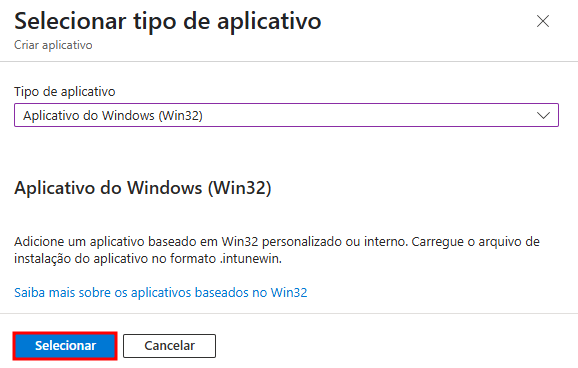</td>
  </tr>
</table>

5. **Clique em Selecionar um arquivo de pacote do aplicativo** e na aba exibida, **clique para localizar o pacote `.intunewin`**;
   > *Nota:* Utilizarei para exemplo o aplicativo *[Image Resizer](https://github.com/bricelam/ImageResizer/releases/download/v3.1.2/ImageResizerSetup-3.1.2.exe)* com os parâmetros para a instalação silenciosa disponibilizados no site [Manage Engine Endpoint Central](https://www.manageengine.com/products/desktop-central/software-installation/silent_install_Image-Resizer-for-Windows-(3.1.2).html).
<table>
  <tr>
    <td>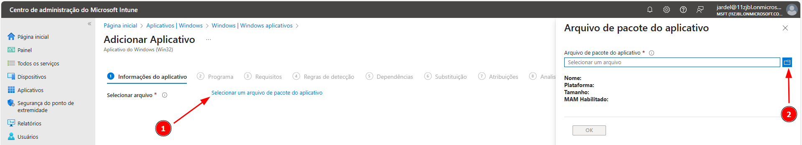</td>
  </tr>
</table>
<table>
  <tr>
    <td>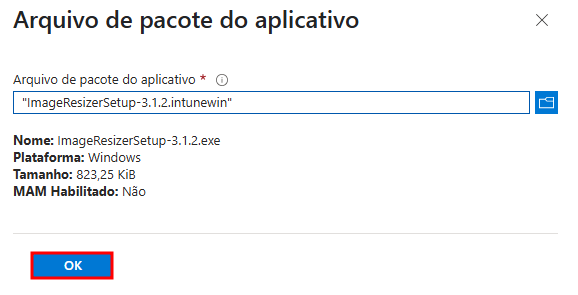</td>
  </tr>
</table>

6. Preencha as informações do aplicativo (nome, descrição, editor);
<table>
  <tr>
    <td>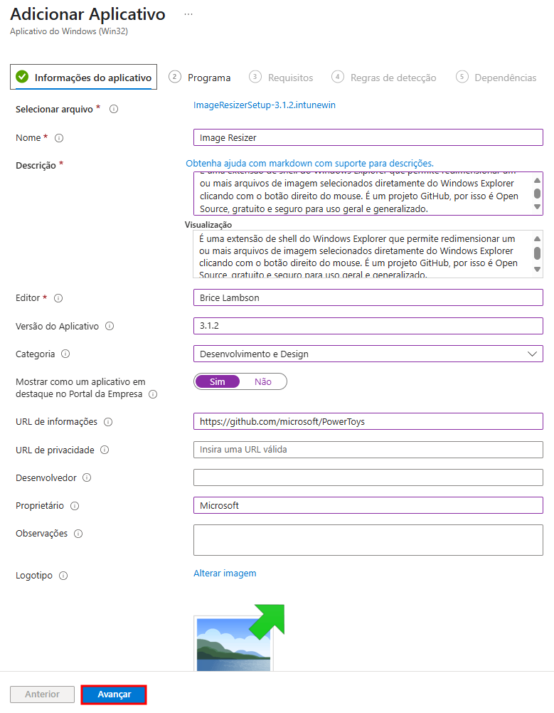</td>
  </tr>
</table>

### 🗂️ Informações Básicas

- **Selecionar arquivo**: Upload do pacote `.intunewin` gerado com a ferramenta Win32 Content Prep Tool.
- **Nome**: Nome amigável do aplicativo visível no Portal da Empresa. Exemplo: `Image Resizer`.
- **Descrição**: Texto que explica a utilidade do app. Pode conter links e formatação básica para ajudar o usuário final a entender o propósito do aplicativo.
- **Visualização**: Área de pré-visualização para conferir como a descrição será apresentada no Portal.
- **Editor**: Nome do desenvolvedor ou fornecedor do software. Exemplo: `Brice Lambson`.
- **Versão do Aplicativo**: Versão que será exibida nas propriedades do app no Intune, utilizada também no controle de versões. Exemplo: `3.1.2`.

### 🗂️ Organização e Exibição

- **Categoria**: Agrupamento funcional do app no Portal da Empresa, como “Produtividade” ou “Desenvolvimento e Design”.
- **Mostrar como um aplicativo em destaque no Portal da Empresa**: Quando ativado, o aplicativo aparece em destaque visual no portal, facilitando a localização pelo usuário.

### 🌐 Informações Adicionais

- **URL de informações**: Link externo com detalhes sobre o app. Exemplo: `https://github.com/microsoft/PowerToys`.
- **URL de privacidade**: Endereço com a política de privacidade do fornecedor.
- **Desenvolvedor**: Nome da pessoa ou equipe técnica responsável pela aplicação (uso interno).
- **Proprietário**: Responsável interno pelo ciclo de vida do app (geralmente da TI ou área solicitante).
- **Observações**: Campo livre para observações como: dependências, observações de instalação ou contexto de uso.

### 🎨 Logotipo

- **Imagem personalizada**: Permite o envio de um ícone customizado para o aplicativo no Portal da Empresa, melhorando a usabilidade visual.


7. Nesta etapa, são definidas as instruções de instalação, desinstalação e comportamento do aplicativo `.intunewin`:
<table>
  <tr>
    <td>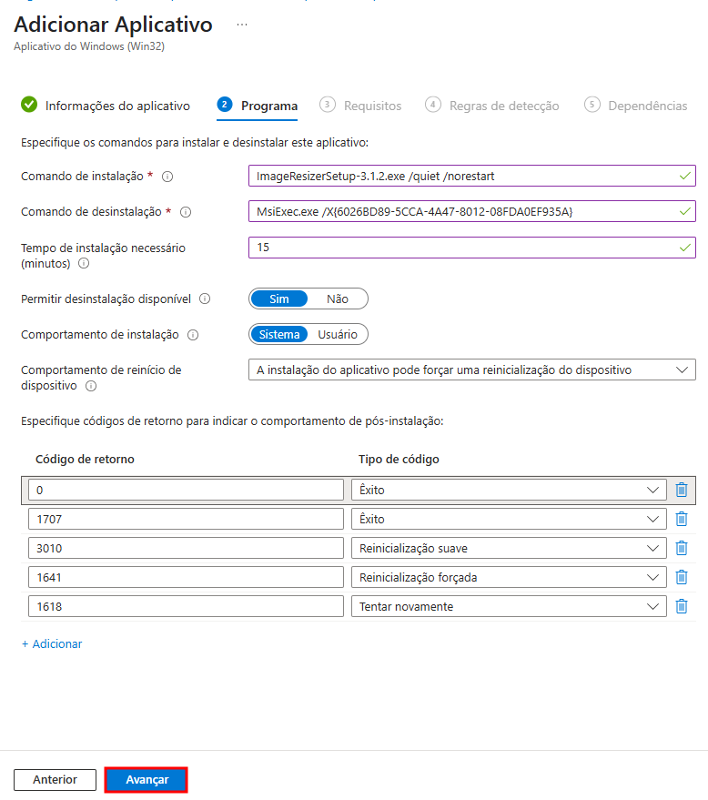</td>
  </tr>
</table>

### 🚀 Comando de Instalação

- **Valor:**: `ImageResizerSetup-3.1.2.exe /quiet /norestart`
	> *Onde:*
	- `/quiet`: instalação silenciosa (sem interface)
	- `/norestart`: impede reinicialização automática após a instalação

### ♻️ Comando de Desinstalação

- **Valor:**: `Msiexec.exe /X{6026BD89-5CCA-4A47-8012-08FDA0E935A}` (obtido através de consulta do {GUID}

### ⏱️ Tempo de Instalação Necessário

- **Valor:** o padrão para este campo é `60 minutos`, mas pode ser ajustado conforme necessário. No exemplo, foi definido como `15 minutos`. Esse tempo representa o **limite máximo que o Intune aguardará pela conclusão da instalação** antes de considerá-la como falha.

	> 💡 *Importante:* evite configurar um tempo muito curto — especialmente em casos de aplicativos robustos (como o Adobe Acrobat Reader DC), cuja instalação pode levar vários minutos. Se o tempo expirar antes da conclusão, o Intune pode interpretar que houve uma falha, mesmo que o processo ainda esteja em andamento.

### 🗑️ Permitir Desinstalação Disponível

- **Valor:**: `Sim`. Permite que o usuário visualize e solicite a remoção do aplicativo pelo Portal da Empresa (Company Portal).

### 🧰 Comportamento de Instalação

- **Valor:**: `Sistema`. Define quem executa a instalação:
  - **Sistema**: instala para todos os usuários do dispositivo (recomendado)
  - **Usuário**: instala apenas para o usuário logado

### 🔁 Comportamento de Reinício

- **Valor:**: `A instalação do aplicativo pode forçar uma reinicialização do dispositivo (padrão)`

### 🔄 Códigos de Retorno

| Código | Tipo de Resultado          |
|--------|----------------------------|
| 0      | Êxito                      |
| 1707   | Êxito                      |
| 3010   | Reinicialização suave      |
| 1641   | Reinicialização forçada    |
| 1618   | Tentar novamente           |

- Cada código de saída é interpretado pelo Intune para saber se a instalação foi bem-sucedida, se precisa reiniciar ou se deve tentar novamente.

8. Nesta etapa são definidos os requisitos mínimos que um dispositivo deve atender para que o aplicativo seja instalado com sucesso:
  > 💡 *Importante:* utilize somente os campos obrigatórios.
<table>
  <tr>
    <td>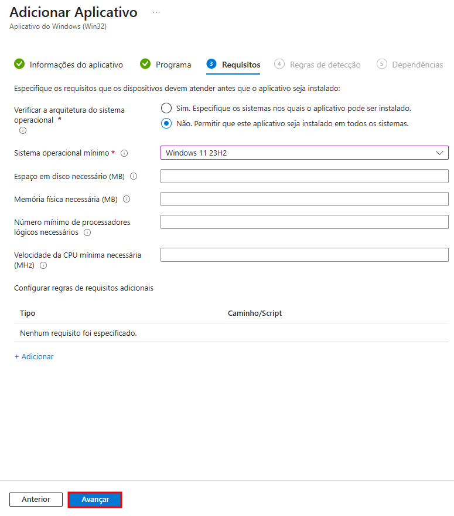</td>
  </tr>
</table>

### 🖥️ Verificar a arquitetura do sistema operacional

- **Sim. Especifique os sistemas nos quais o aplicativo pode ser instalado**  
Permite selecionar quais versões do Windows serão compatíveis com a instalação. Ideal para evitar instalação em sistemas legados ou incompatíveis.

- **Não. Permitir que este aplicativo seja instalado em todos os sistemas** (`recomendado`)  
Aplica o aplicativo independentemente da arquitetura ou versão do sistema operacional.

### 🧱 Sistema operacional mínimo

- Exemplo: `Windows 11 23H2`. Define a versão mínima do Windows permitida para a instalação. O Intune usará essa informação para verificar se o dispositivo é compatível.

### Os demais itens desta tela:

- 💽 Espaço em disco necessário (MB)
- 🧠 Memória física necessária (MB)
- 🧮 Número mínimo de processadores lógicos necessários
- ⚡ Velocidade da CPU mínima necessária (MHz)
- 🔎 Regras de requisitos adicionais

> **Por padrão não são modificados.**

9. Nesta etapa, as regras de detecção são responsáveis por informar ao Intune quando um aplicativo já está presente no dispositivo. Com isso, o serviço evita reinstalar apps existentes e aplica lógica de compliance com mais precisão.
<table>
  <tr>
    <td>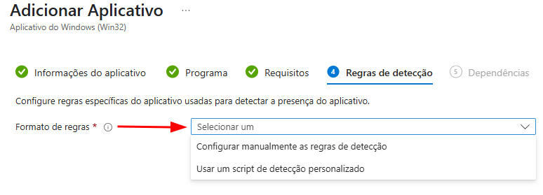</td>
  </tr>
</table>
<table>
  <tr>
    <td>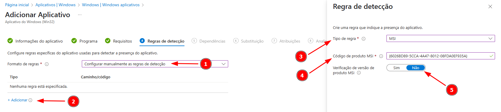</td>
  </tr>
</table>

### 📌 Formato de Regras

Campo obrigatório que determina como a detecção será realizada:

#### 🔘 Opções disponíveis:

1. **Configurar manualmente as regras de detecção**  
   Permite definir uma ou mais regras baseadas em:
   - MSI ({GUID})
   - Arquivo ou pasta
   - Registro
   Em geral é a opção mais utilizada.

2. **Usar um script de detecção personalizado**  
   Permite carregar um script PowerShell que o Intune executará para identificar se o app está instalado.  
   Ideal para instalações complexas ou apps que não deixam rastros padrão no sistema.

#### 📥 Quando usar cada uma:

| Cenário | Recomendação |
|--------|---------------|
| Aplicativo MSI com entrada no registro | Configurar manualmente |
| Instaladores silenciosos sem padrão claro | Script de detecção |
| Instalações que geram arquivos com caminho conhecido | Detecção por caminho de arquivo |

> Para saber mais, acesse [Exemplos de Regra de Detecção](https://github.com/jardelsantos78/intune-deploy-apps/tree/main/win32-regras-deteccao-exemplos.md)

10. 
13. Atribua aos grupos.
14. Conclua o processo e acompanhe a implantação.

 

---
