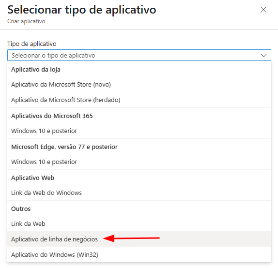
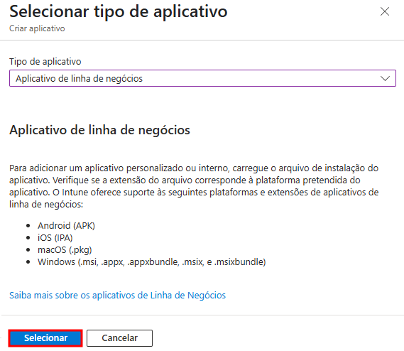
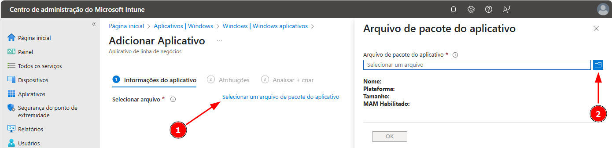
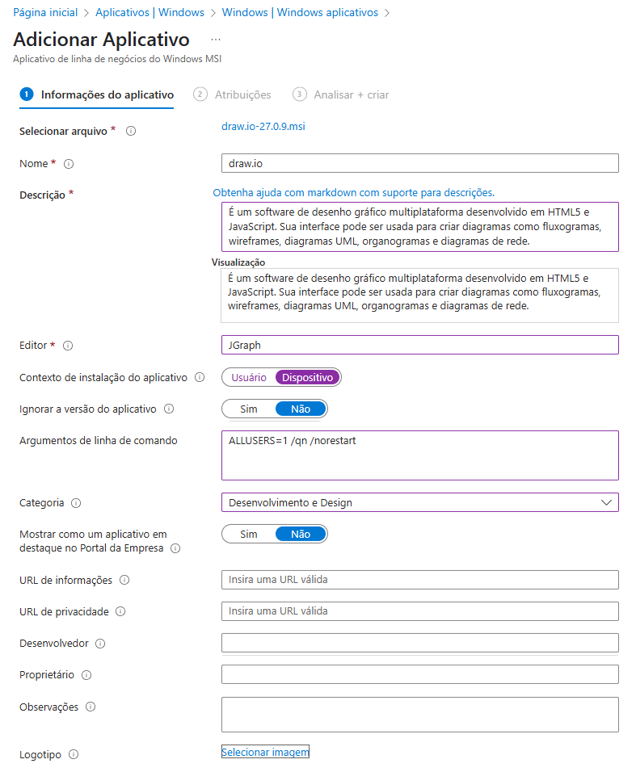
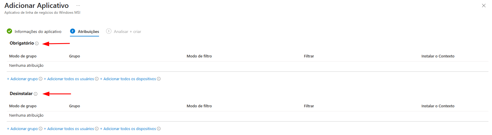
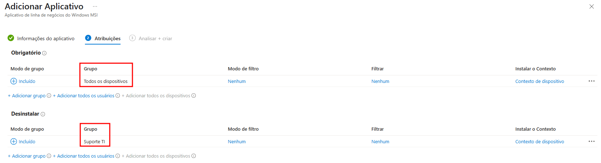
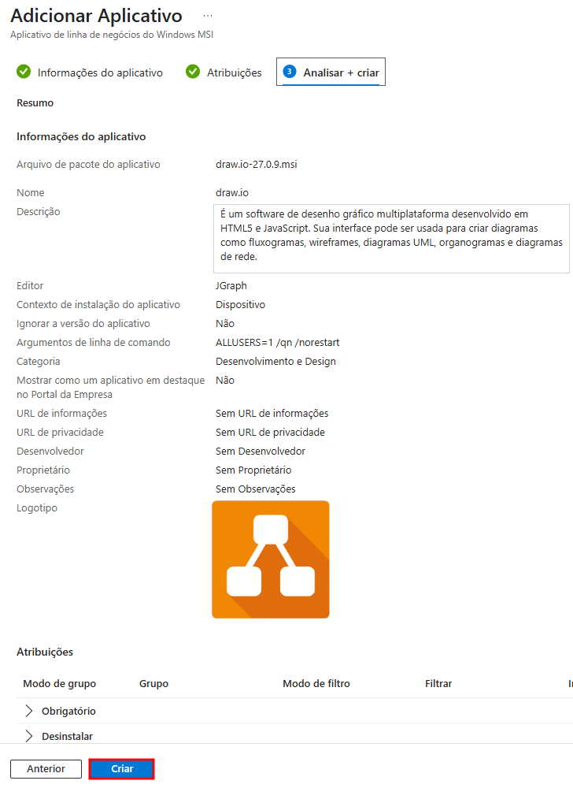
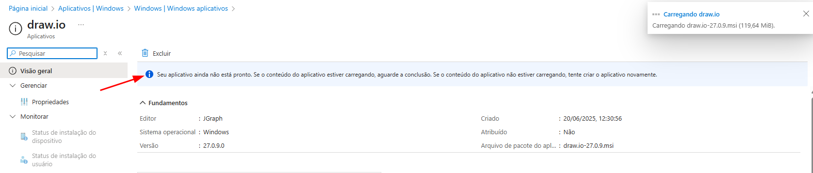
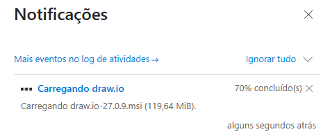
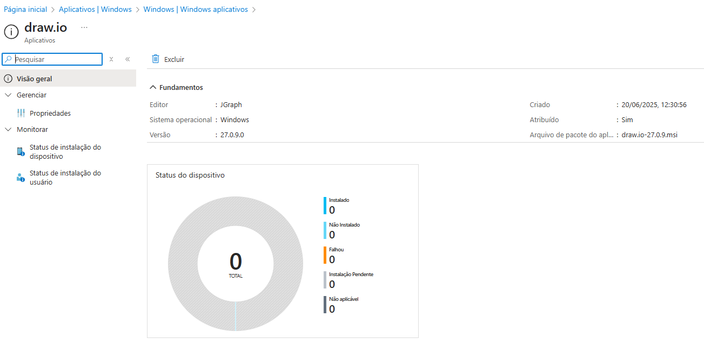

# 📦 Deploy de Aplicativos MSI via Intune

Este guia apresenta o passo a passo para distribuir instaladores no formato `.MSI` utilizando o Microsoft Intune.

## ✅ Pré-requisitos

- Arquivo `.msi` válido.
- Conhecimento dos parâmetros de instalação silenciosa, se aplicável.
   > **Dica**: consulte os sites [SilentInstalHQ](https://silentinstallhq.com/) ou [Manage Engine Endpoint Central](https://www.manageengine.com/products/desktop-central/software-installation/latest-software.html) para descobrir os parâmetros de instalação silenciosa
- Permissão para criar políticas de aplicativos no Intune.

## 🚀 Etapas

1. Acesse o [Centro de Administração do Microsoft Intune](https://intune.microsoft.com);
2. Navegue até **Aplicativos > Todos os aplicativos > Criar**;
<table>
  <tr>
    <td></td>
  </tr>
</table>

3. Escolha o tipo de aplicativo: **App de linha de negócios**;
<table>
  <tr>
    <td></td>
  </tr>
</table>

4. Certifique-se de que a opção `.msi` é listada e **clique em Selecionar**;
<table>
  <tr>
    <td></td>
  </tr>
</table>

5. **Clique em Selecionar um arquivo de pacote do aplicativo** e na aba exibida, **clique para localizar o arquivo `.msi`**;
   > *Nota:* Utilizarei para exemplo o aplicativo *[Draw.io](https://get.diagrams.net/)* com os parâmetros para a instalação silenciosa disponibilizados no site [Manage Engine Endpoint Central](https://www.manageengine.com/products/desktop-central/software-installation/silent_install_Draw.io-(MSI)-(x64)-(26.1.1).html).
<table>
  <tr>
    <td></td>
  </tr>
</table>
<table>
  <tr>
    <td></td>
  </tr>
</table>

6. Preencha as informações do aplicativo (nome, descrição, editor);
<table>
  <tr>
    <td></td>
  </tr>
</table>

### 📦 Upload do Arquivo

- **Selecionar arquivo**: Upload do instalador `.msi` que será usado para distribuição. Exemplo: `draw.io-27.0.9.msi`.

### 🏷️ Identificação e Descrição

- **Nome**: Nome do aplicativo conforme será exibido no Intune e no Portal da Empresa.
- **Descrição**: Informações descritivas sobre o app. Aceita Markdown e é visível aos usuários finais.
- **Visualização**: Mostra como a descrição será exibida para o usuário no Portal da Empresa.
- **Editor**: Nome do fornecedor ou fabricante do software. Exemplo: `JGraph`.

### ⚙️ Configurações de Instalação

- **Contexto de instalação do aplicativo**  
  - **Usuário**: instala apenas no perfil do usuário atual.  
  - **Dispositivo**: instala para todos os usuários do dispositivo (recomendado em ambientes corporativos).

- **Ignorar a versão do aplicativo**  
  - **Sim**: o Intune não considera a versão para ações futuras.  
  - **Não**: usa a versão para verificar necessidade de reinstalação ou atualização.

- **Argumentos de linha de comando**  
  Parâmetros de instalação silenciosa. Exemplo:
  ```powershell
  ALLUSERS=1 /qn /norestart
  ```
  Onde:
  - `ALLUSERS=1` → instala para todos os usuários  
  - `/qn` → instalação sem interface (modo silencioso)  
  - `/norestart` → impede reinicialização automática

### 🗂️ Organização

- **Categoria**: Classificação funcional do app no Portal da Empresa, como "Desenvolvimento e Design".
- **Mostrar como um aplicativo em destaque no Portal da Empresa**: Destaque visual para facilitar descoberta pelo usuário.

### 🌐 Informações Adicionais

- **URL de informações**: Link para mais informações sobre o app (página do produto, por exemplo).
- **URL de privacidade**: Link para política de privacidade do app.
- **Desenvolvedor**: Nome do desenvolvedor responsável. Pode ser usado para referência interna.
- **Proprietário**: Pessoa ou time interno responsável pelo app.
- **Observações**: Campo para notas adicionais, como requisitos, contexto de uso ou dependências.
- **Logotipo**: Upload de imagem para representar o aplicativo no Portal da Empresa.

7. Atribua o aplicativo a grupos de usuários ou dispositivos.
<table>
  <tr>
    <td></td>
  </tr>
</table>

- Neste exemplo, o aplicativo foi atribuído como instalação obrigatória para todos os dispositivos gerenciados. No entanto, em ambientes corporativos reais, nem todos os aplicativos devem ser implantados desta forma. Para um gerenciamento mais seguro do deploy, é altamente recomendável utilizar grupos do Azure AD (Entra ID), permitindo segmentações por área, função ou departamento.
<table>
  <tr>
    <td></td>
  </tr>
</table>

8. Por fim, **revise o aplicativo e se estiver tudo certo, clique em Criar**:
<table>
  <tr>
    <td></td>
  </tr>
</table>

> *Nota:* dependendo do tamanho do arquivo, o upload levará um certo tempo para ser concluído:
<table>
  <tr>
    <td></td>
  </tr>
</table>
<table>
  <tr>
    <td></td>
  </tr>
</table>

9. O monitoramento do aplicativo poderá ser acompanhado através da guia Monitorar e a instalação nos dispositivos atribuídos como obrigatórios ocorrerá automaticamente na próxima sincronização do Intune:
<table>
  <tr>
    <td></td>
  </tr>
</table>

---

⬅️ [Voltar à Página Principal](https://github.com/jardelsantos78/intune-deploy-apps/tree/main)
