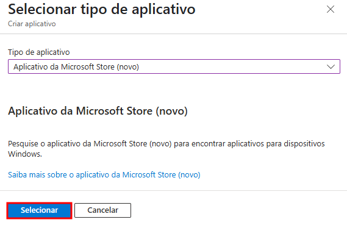
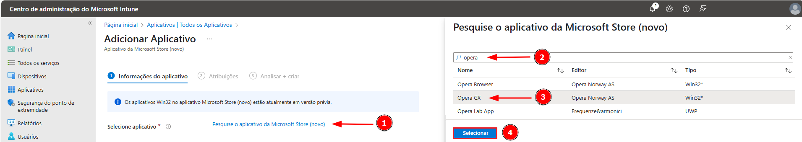
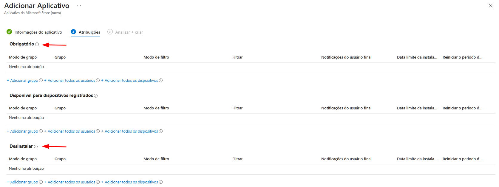
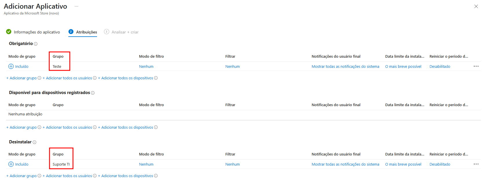
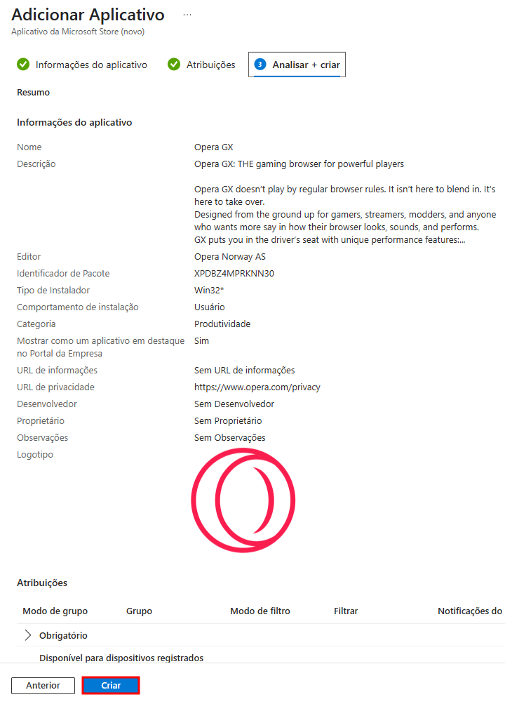
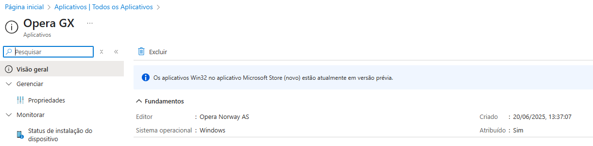
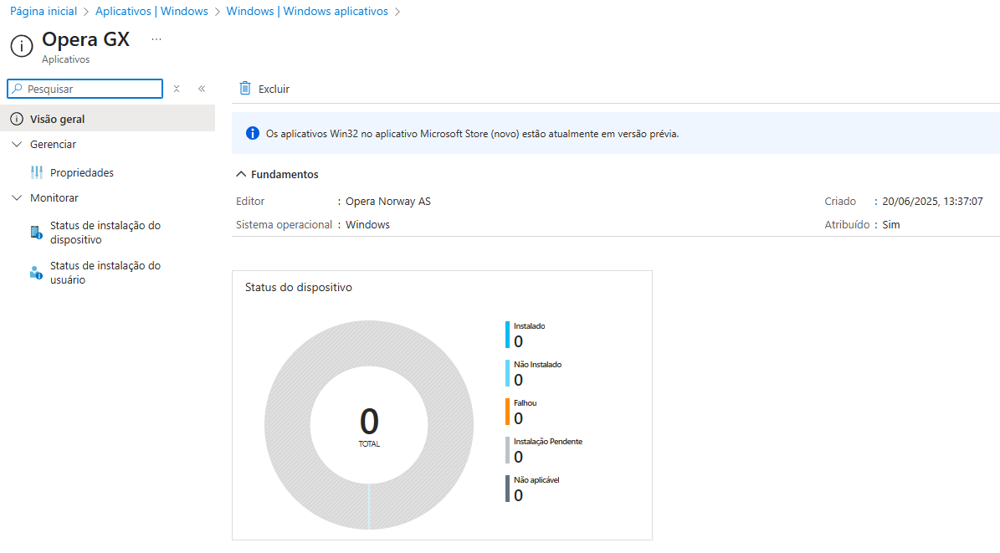

# 🛍️ Deploy de Aplicativos da Microsoft Store via Intune

Este guia apresenta o passo a passo para distribuir aplicativos diretamente da Microsoft Store usando o Intune.

## ✅ Pré-requisitos

- Aplicativo deve estar disponível na **Microsoft Store (versão nova)**.
- Permissões de administração no Intune.

## 🚀 Etapas

1. Acesse o [Centro de Administração do Microsoft Intune](https://intune.microsoft.com);
2. Navegue até **Aplicativos > Todos os aplicativos > Criar**;
<table>
  <tr>
    <td></td>
  </tr>
</table>

3. Escolha a opção **Aplicativo do Microsoft Store (novo)** e em seguida, **clique em Selecionar**;
<table>
  <tr>
    <td></td>
  </tr>
</table>

4. Clique em **Pesquise o aplicativo da Microsoft Store (novo)**;
5. Digite o nome do aplicativo. marque-o na lista exibida e **clique em Selecionar**;
<table>
  <tr>
    <td></td>
  </tr>
</table>

6. Preencha as informações adicionais e **clique em Avançar**;
<table>
  <tr>
    <td></td>
  </tr>
</table>

### 🏷️ Identificação do Aplicativo

- **Nome**: Nome amigável do app exibido no Portal da Empresa. Exemplo: `Opera GX`.
- **Descrição**: Apresenta as funcionalidades e características principais do app. Pode conter formatação e ajuda os usuários a entenderem o propósito da aplicação.
- **Editor**: Nome do fornecedor do aplicativo. Exemplo: `Opera Norway AS`.
- **Identificador de Pacote**: Valor exclusivo que identifica o app na Microsoft Store. Exemplo: `XPDBZ4MPRKNN30`.

### ⚙️ Configurações de Instalação

- **Tipo de Instalador**: Tipo de empacotamento utilizado (ex: `Win32*`), o que indica que o app será instalado via WinGet por trás dos panos.

- **Comportamento de Instalação**  
  - `Sistema`: instala para todos os usuários do dispositivo
  - `Usuário`: instala somente para o usuário logado

### 🗂️ Organização no Portal

- **Categoria**: Classificação do aplicativo. Facilita a organização e a descoberta no portal. Exemplo: `Produtividade`.
- **Mostrar como um aplicativo em destaque no Portal da Empresa**  
  - `Sim`: destaca visualmente o app no portal.
  - `Não`: app aparece normalmente na lista.

### 🌐 Informações Adicionais (opcionais)

- **URL de Informações**: Link para documentação ou página oficial do app.
- **URL de Privacidade**: Endereço para a política de privacidade do fornecedor. Exemplo: `https://www.opera.com/privacy`.
- **Desenvolvedor**: Nome da pessoa ou equipe técnica responsável pelo app (uso interno).
- **Proprietário**: Responsável interno pela aplicação. Útil para organização e suporte.
- **Observações**: Campo livre para anotações adicionais sobre o app, como dependências, comportamento, contexto de uso etc.

### 🎨 Personalização Visual

- **Logotipo**: Imagem opcional que será usada como ícone no Portal da Empresa. Melhora a identidade visual e usabilidade.

7. Atribua o aplicativo aos grupos desejados:
<table>
  <tr>
    <td></td>
  </tr>
</table>

- Neste exemplo, o aplicativo foi atribuído como **instalação obrigatória para todos os usuários que fazem parte do grupo Teste**. Para um gerenciamento mais seguro do deploy, sempre que possível, utilize grupos do Azure AD (Entra ID), permitindo segmentações por área, função ou departamento:
<table>
  <tr>
    <td></td>
  </tr>
</table>

8. Por fim, **revise o aplicativo e se estiver tudo certo, clique em Criar:**
<table>
  <tr>
    <td></td>
  </tr>
</table>

> *Nota:*
  > Caso a mensagem *Os aplicativos Win32 no aplicativo Microsoft Store (novo) estão atualmente em versão prévia.* apareça para você, **significa que o suporte à instalação de aplicativos Win32** diretamente pela Microsoft Store (novo) no Intune **ainda está em fase de prévia** — ou seja, **é uma funcionalidade em desenvolvimento e testes**.
<table>
  <tr>
    <td></td>
  </tr>
</table>

9. O monitoramento do aplicativo poderá ser acompanhado através da guia Monitorar e a instalação nos dispositivos atribuídos como obrigatórios ocorrerá automaticamente na próxima sincronização do Intune:
<table>
  <tr>
    <td></td>
  </tr>
</table>

> ⚠️ Observação: Aplicativos Microsoft Store (novo) são executados em modo silencioso e não requerem parâmetros extras de instalação.

---

⬅️ [Voltar à Página Principal](https://github.com/jardelsantos78/intune-deploy-apps/tree/main)
